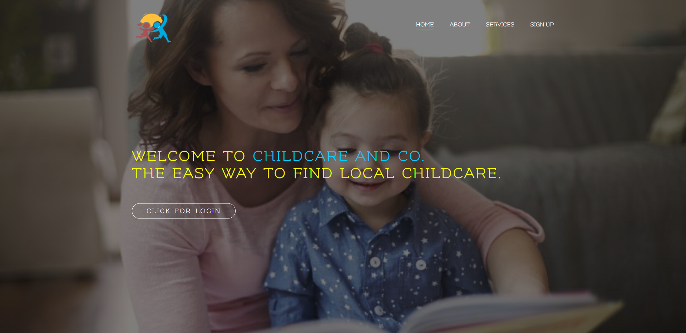
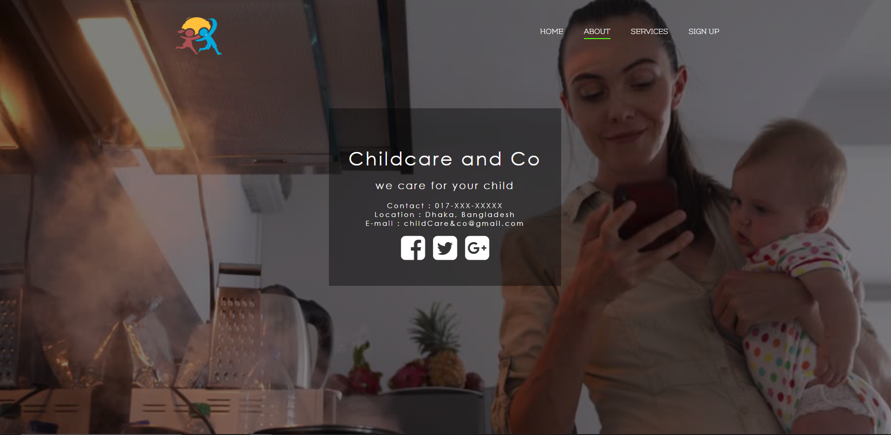
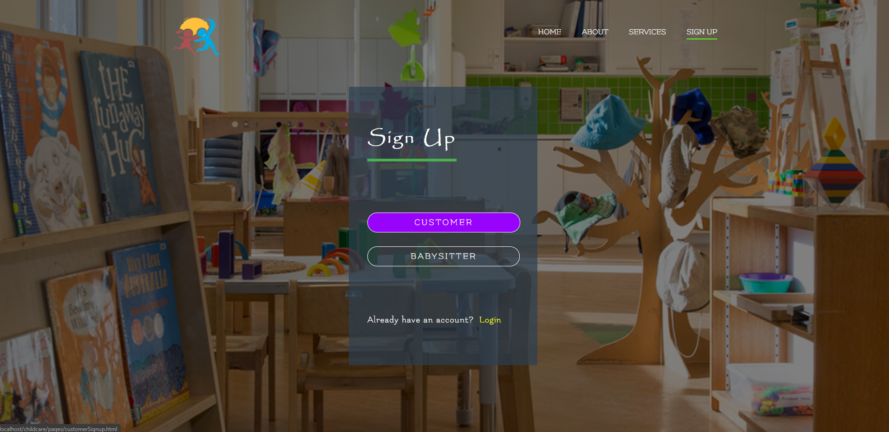
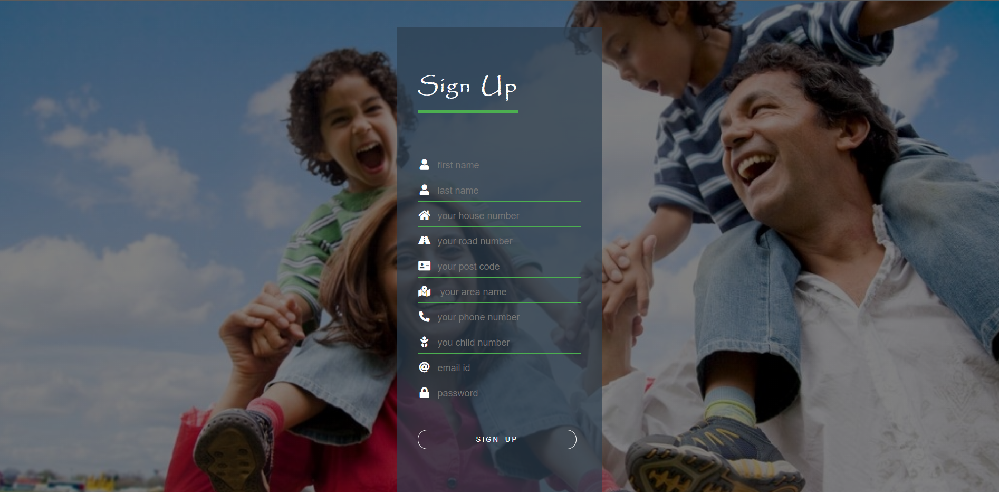
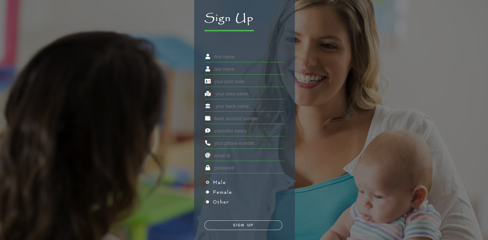
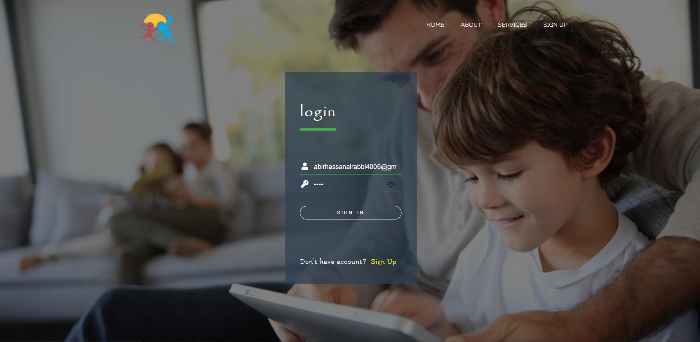
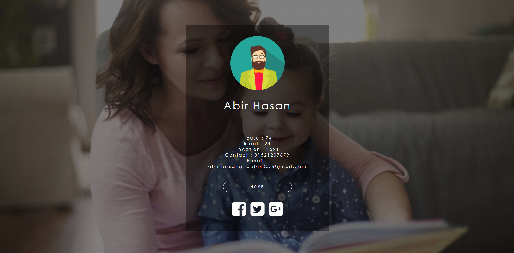
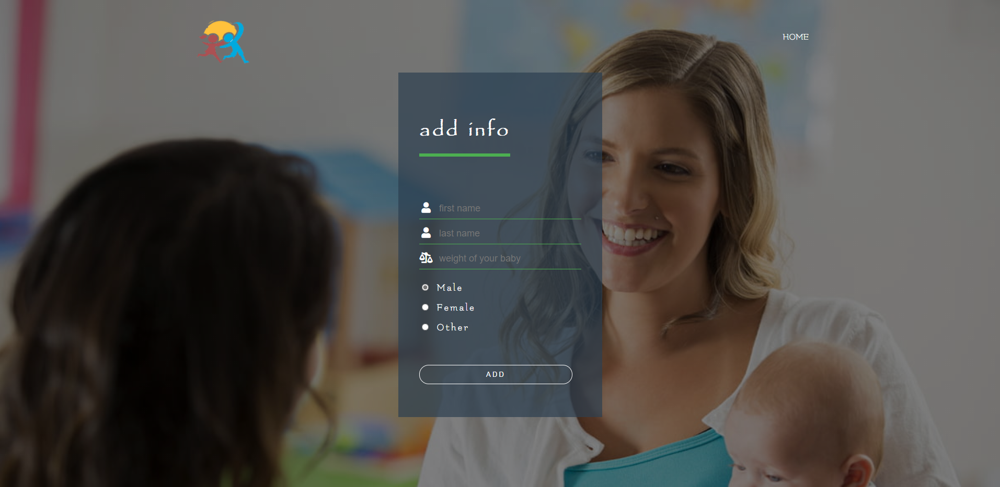
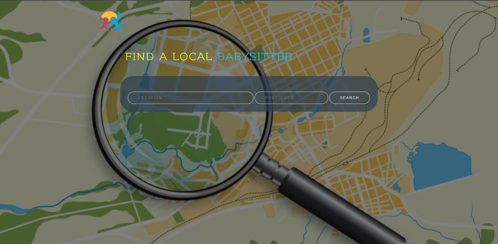
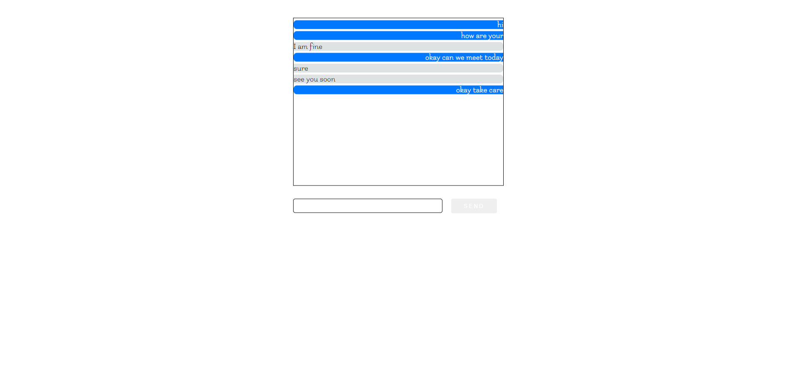

# child-care
 A web based platform for working parents for their children. (2018)
 This is made for my Database Management Systems Laboratory in 2019. This is a child care platfrom for working parents.

 ## Project description
Name: child care  
Fronted Language: HTML, CSS, JS  
Backend : PHP  
Platform: WEB  
Project No: 11  
Year: 2019

## Demo Video
<!--  -->

## Screen shot
### Home
 

### About
 

### Singup
 

 

 

### Login
 

### User profile
 

### Add child info 
 

### Search
 

### Chat
 

## Authors

* **AbirHasan**

Check out my other works [@XAbirHasan](https://github.com/XAbirHasan)
